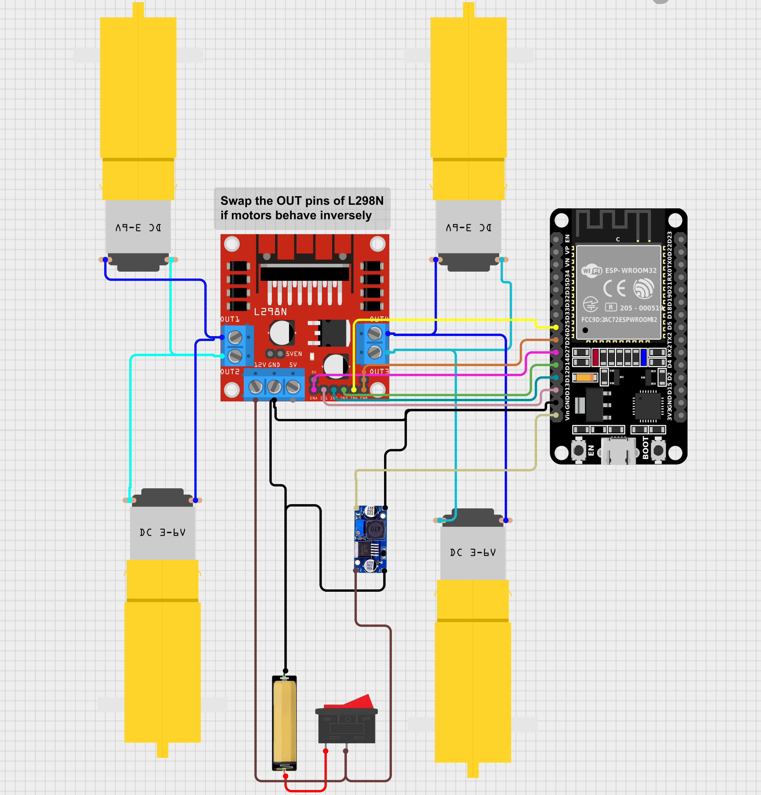

# PUSHBOT

---

## What is this?

Pushbot is a 4-wheeled robot car that you control wirelessly from your smartphone over Bluetooth. You send commands from a free app on your phone, and the robot moves forward, backward, turns, and more.

It's built using:
- An **ESP32** microcontroller (the brain)
- An **L298N motor driver** (controls the motors)
- **4 DC gear motors** (the wheels)
- A **LiPo battery** (the power source)

---

## What you need

### Hardware
| Part | Purpose |
|---|---|
| ESP32 NodeMCU board | The brain of the robot |
| L298N motor driver module | Drives the 4 motors |
| 4× DC motors (3–6V) | The wheels |
| LiPo battery | Powers everything |
| Step-down buck converter | Converts battery voltage to safe ESP32 voltage |
| Rocker switch | On/off switch |
| Jumper wires | Connections |

### Software (on your computer)
- [Arduino IDE](https://www.arduino.cc/en/software) — to upload the code
- ESP32 board support installed in Arduino IDE ([guide here](https://docs.espressif.com/projects/arduino-esp32/en/latest/installing.html))

### App (on your phone — Android only ⚠️)
- **Bluetooth RC Controller** by broxcode (free on Google Play)
> ⚠️ This uses Classic Bluetooth, which iPhones do not support. Android only.

---

## Wiring

Connect the ESP32 to the L298N like this:

| Wire goes FROM (ESP32 pin) | Wire goes TO (L298N pin) | What it does |
|---|---|---|
| GPIO 13 | AIN1 | Controls Left motor direction |
| GPIO 12 | AIN2 | Controls Left motor direction |
| GPIO 27 | ENA | Controls Left motor speed |
| GPIO 14 | BIN1 | Controls Right motor direction |
| GPIO 25 | BIN2 | Controls Right motor direction |
| GPIO 26 | ENB | Controls Right motor speed |

> 💡 **Motors going the wrong way?** Just swap the OUT1/OUT2 (or OUT3/OUT4) wires on the L298N. No code change needed.

---
## Wiring

...wiring table...

## Circuit Diagram

## How to upload the code

1. Download and open `final_pushbot_maybe.ino` in Arduino IDE
2. Go to **Tools → Board** and select **ESP32 Dev Module**
3. Plug your ESP32 into your computer via USB
4. Go to **Tools → Port** and select the correct port (usually called COM3, COM4, etc. on Windows or /dev/ttyUSB0 on Linux)
5. Click the **Upload** button (→ arrow icon)
6. Once done, open **Tools → Serial Monitor**, set baud rate to **115200**
7. You should see: `Bluetooth initiated. Pair with Pushbot 1` ✅

---

## How to control it

### Step 1 — Pair your phone
1. Turn on the robot (flip the rocker switch)
2. On your Android phone, go to **Settings → Bluetooth**
3. Search for and pair with **"Pushbot 1"** (no PIN needed)

### Step 2 — Open the app
1. Open **Bluetooth RC Controller**
2. Tap the connect button and select **Pushbot 1**
3. Use the on-screen buttons to drive!

### Controls reference

| Button in app | What the robot does |
|---|---|
| Forward | Moves straight ahead |
| Backward | Moves straight back |
| Left | Pivots left |
| Right | Pivots right |
| Forward-Left | Curves forward to the left |
| Forward-Right | Curves forward to the right |
| Backward-Left | Curves backward to the left |
| Backward-Right | Curves backward to the right |
| Stop | Stops all motors |

You can also control **speed** using the speed slider in the app (0 = stopped, max = full speed).

---

## How it works (simple explanation)

- The app sends a single letter to the ESP32 over Bluetooth (e.g. `F` for forward, `B` for backward)
- It also sends a number for speed (`0`–`9` for 0–90%, `q` for 100%)
- The ESP32 reads these and tells the L298N how to run the motors
- **Smooth acceleration:** Speed increases gradually so the robot doesn't jerk suddenly
- **Auto-stop safety:** If your phone disconnects or the app stops sending commands, the robot stops automatically after 300ms

---

## Troubleshooting

| Problem | Fix |
|---|---|
| Robot not showing up in Bluetooth | Make sure the robot is powered on and you're on Android |
| Motors not spinning | Check your wiring and battery charge |
| Motors spinning backwards | Swap OUT1↔OUT2 or OUT3↔OUT4 on the L298N |
| Upload fails | Make sure the correct COM port and board (ESP32 Dev Module) are selected |
| Robot moves but very slow | Battery might be low, or speed slider in app is turned down |
